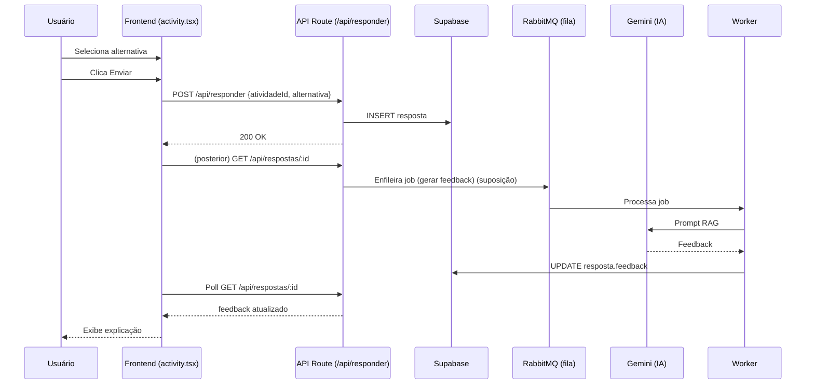

# 🏛 Arquitetura

Esta seção descreve como o projeto está organizado internamente.

## 🗂 Árvore de Diretórios (Resumo)

(Exibindo apenas partes principais mencionadas)

```text
next-structlive/
├── src/
│   ├── app/
│   │   ├── estruturas/
│   │   │   ├── [structureId]/       # Rota dinâmica para módulos
│   │   │   ├── lista/
│   │   │   │   ├── types/
│   │   │   │   │   ├── ldse/        # Lista Dinâmica Simplesmente Encadeada
│   │   │   │   │   ├── ldde/        # Lista Dinâmica Duplamente Encadeada
│   │   │   │   │   ├── lee/         # Lista Estática Encadeada
│   │   │   │   │   ├── les/         # Lista Estática Sequencial
│   │   │   │   │   └── lc/          # Lista Circular
│   │   │   │   ├── module.config.ts # Metadados do módulo
│   │   │   │   └── config.ts        # Registro de tipos
│   │   │   └── index.ts             # Registry global de módulos
│   │   ├── api/                     # API Routes
│   │   │   ├── auth/
│   │   │   ├── atividades/
│   │   │   ├── responder/
│   │   │   ├── respostas/
│   │   │   └── logs/
│   │   └── globals.css
│   ├── components/
│   │   ├── sidebar/
│   │   └── ui/                      # shadcn/ui components
│   ├── lib/                         # Utilitários e configurações
│   │   └── structure-registries.ts  # Registry master
│   └── test/                        # Config de testes
├── scripts/                          # Scripts de automação
│   ├── create-module.ts             # Criar novos módulos
│   └── create-type.ts               # Adicionar tipos
├── workers/
│   └── responderWorker.ts           # Worker RabbitMQ
├── docs/                            # Documentação completa
└── README.md
```

## 🧱 Camadas (Lógicas)

| Camada                 | Papel                               | Exemplos                          |
| ---------------------- | ----------------------------------- | --------------------------------- |
| Interface (UI)         | Componentes React e páginas         | /src/app/home/page.tsx            |
| Módulos Educacionais   | Lógica específica de cada estrutura | /src/app/estruturas/lista/...     |
| Serviços / Utilitários | Regras de negócio, helpers          | /src/lib/\* (não listado)         |
| API Routes             | Endpoints REST (App Router)         | /src/app/api/\*                   |
| Integração IA          | Geração de feedback                 | rag_contexts.ts + chamadas Gemini |
| Persistência           | Banco Supabase                      | Acessos via libs (não mostradas)  |
| Filas                  | Processamento assíncrono            | RabbitMQ + /workers               |
| Autenticação           | Sessões de usuário                  | NextAuth                          |

## 🔌 Pontos de Entrada

- Web: App Router do Next.js (cada diretório com page.tsx).
- Rotas dinâmicas: /src/app/estruturas/[structureId]/page.tsx
- Módulos: /src/app/estruturas/lista/ (com 5 tipos: LDSE, LDDE, LEE, LES, LC)
- Atividades: /src/app/estruturas/lista/types/[tipo]/activity.tsx

## 🚦 Rotas / Endpoints

Formato padrão Next.js App Router:

```
/src/app/api/<nome>/route.ts
```

**API Routes Implementadas:**

- `GET /api/atividades` - Lista atividades disponíveis
- `POST /api/responder` - Submete resposta de atividade
- `GET /api/respostas/:id` - Busca status/feedback
- `/api/auth/*` - Autenticação NextAuth
- `POST /api/logs` - Logging de eventos

**Localização:**
```
src/app/api/
├── atividades/route.ts
├── responder/route.ts
├── respostas/[id]/route.ts
├── auth/[...nextauth]/route.ts
└── logs/route.ts
```

## 🧠 Estado Global

Trecho em /src/app/home/page.tsx:

Gerenciamento de estado está distribuído entre:

- **Contextos React**: Para estado UI e autenticação
- **Server State**: Via Supabase para dados persistentes
- **Session**: NextAuth para autenticação
- **Registros**: Sistema de configuração em `src/app/estruturas/index.ts` e `src/lib/structure-registries.ts`

## 📄 Exemplo de Análise IA

Arquivo: /src/app/estruturas/lista/types/ldse/rag_contexts.ts monta prompt contextualizado com:

- objetivo
- requisitos
- critérios de avaliação

## 🔄 Fluxo Request → Response (Exemplo Submissão de Resposta)



## 🧾 Variáveis de Ambiente (Consolidadas)

| Variável                         | Uso                    | Observação                |
| -------------------------------- | ---------------------- | ------------------------- |
| GOOGLE_CLIENT_ID / SECRET        | OAuth Google           | Cadastro no Google Cloud  |
| NEXTAUTH_SECRET                  | Criptografia de sessão | Gerar via OpenSSL         |
| NEXTAUTH_URL                     | URL base               | http://localhost:3000 dev |
| SUPABASE_URL                     | Acesso DB              | Projeto Supabase          |
| SUPABASE_SERVICE_ROLE_KEY        | Chave privilegiada     | Manter privada            |
| GEMINI_API_KEY / GEMINI_API_KEY2 | IA (Gemini)            | Chave e reserva           |
| RABBITMQ_URL                     | Filas                  | Docker local ou CloudAMQP |

## 🗄 Banco de Dados (Suposição)

Provável tabelas (não encontradas):

- usuarios
- atividades
- respostas
- logs_ia
  Adicionar migrations estruturadas (ver tutorial de módulo para exemplo).

## 🤖 Filas

- Worker (suposição em /workers) consome mensagens para:
  - Gerar feedback IA
  - Registrar logs
  - Enviar emails (possível extensão)

## 🔐 Autenticação

- Implementada com NextAuth (Google Provider).
- Sessão obtida em componentes via useSession() (ex: activity.tsx).

## 🧪 Testes

- Vitest (scripts listados em README).
- Diretórios de testes: **tests**/ (unitários) + possível config em /src/test.

## 🎨 UI / Componentes

- shadcn/ui em /src/components/ui.
- Ícones lucide-react.
- Estilização: Tailwind (arquivo global em /src/app/globals.css – não listado, suposição).

## 📝 Logs

Função registrarLogIA em /src/lib/logIAHelper (arquivo não visto → suposição).
Chamado em activity.tsx para trilha de eventos: enviar_resposta, solicitar_explicacao, receber_explicacao, timeout_explicacao.

## 🧩 Extensibilidade

Novo módulo segue padrão:

```
src/app/estruturas/<nome>/
├── module.config.ts     # Metadados (ícone, título, etc.)
├── config.ts            # Registro de tipos
└── types/
    └── <variação>/
        ├── theory.tsx
        ├── visualization.tsx
        ├── activity.tsx
        ├── challenge.tsx
        └── config.ts
```

**Recomendado:** Use os scripts de automação!
- Ver [docs/modules.md](modules.md) para usar `create-module.ts` e `create-type.ts`
- Ver [docs/how-to-add-a-module.md](how-to-add-a-module.md) para processo manual

## 🛡 Boas Práticas Recomendadas

- Segregar prompts IA em arquivos dedicados (já feito).
- Adicionar tipagem forte para respostas de API (DTOs).
- Implementar caching para listas de atividades.
- Centralizar fetch em hooks ou services.

## 🚨 Erros Comuns

| Sintoma                     | Causa                             | Solução                 |
| --------------------------- | --------------------------------- | ----------------------- |
| 401 após login              | NEXTAUTH_SECRET incorreta         | Regenerar e reiniciar   |
| Falha fetch /api/atividades | Rota não criada                   | Criar route.ts          |
| Feedback não aparece        | Worker não rodando / fila ausente | Subir RabbitMQ e worker |
| Variáveis undefined         | .env faltando                     | Ver docs/setup.md       |

## 🧭 Próximo

Criar um módulo novo? Vá para docs/how-to-add-a-module.md.
