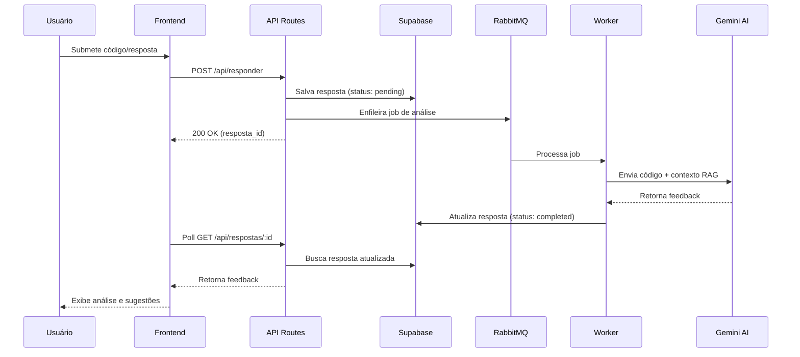

# 🌐 Visão Geral

StructLive é uma plataforma educacional para aprender Estruturas de Dados de forma:

- **Visual** - Animações e visualizações interativas
- **Prática** - Desafios de código e atividades hands-on
- **Interativa** - Feedback em tempo real e análise por IA
- **Gamificada** - Sistema de progresso e conquistas

## 🎯 Problema que Resolve

Estudantes iniciantes têm dificuldade em "ver" como listas, filas ou árvores funcionam internamente. O StructLive oferece:

- Visualizações passo a passo de operações (inserir, remover, percorrer)
- Feedback inteligente via IA para análise de código
- Atividades práticas com diferentes níveis de dificuldade
- Sistema de registro de progresso

## 🧩 Principais Funcionalidades

### Autenticação e Personalização
- Login via Google OAuth (NextAuth.js)
- Perfil de usuário personalizado
- Rastreamento de progresso individual

### Módulos de Aprendizado
- **Listas** - Módulo completo com 5 tipos diferentes:
  - LDSE (Lista Dinâmica Simplesmente Encadeada)
  - LDDE (Lista Dinâmica Duplamente Encadeada)
  - LEE (Lista Estática Encadeada)
  - LES (Lista Estática Sequencial)
  - LC (Lista Circular)

### Sistema Modular e Extensível
- Arquitetura baseada em registros de módulos e tipos
- Scripts de automação para criar novos módulos rapidamente
- Sistema de componentes reutilizáveis (teoria, visualização, atividade, desafio)

### Análise por IA
- Feedback contextualizado via Google Gemini
- Prompts RAG (Retrieval Augmented Generation) personalizados
- Processamento assíncrono via RabbitMQ
- Sistema de fallback com múltiplas API keys

### Infraestrutura
- Persistência de dados via Supabase
- Sistema de filas (RabbitMQ) para processamento assíncrono
- API Routes para comunicação frontend-backend
- Workers dedicados para tarefas pesadas

## 🏗️ Diagrama de Arquitetura

```mermaid
graph TB
    subgraph "Frontend - Next.js App Router"
        A[Usuário/Navegador]
        B[Páginas React]
        C[Componentes UI shadcn/ui]
        D[Contextos e Estado]
    end
    
    subgraph "Backend - Next.js API Routes"
        E[/api/auth - Autenticação]
        F[/api/atividades - Atividades]
        G[/api/responder - Submissões]
        H[/api/respostas - Feedback]
        I[/api/logs - Logging]
    end
    
    subgraph "Serviços Externos"
        J[(Supabase PostgreSQL)]
        K[Google OAuth]
        L[Google Gemini AI]
        M{{RabbitMQ Filas}}
    end
    
    subgraph "Workers Assíncronos"
        N[responderWorker.ts]
    end
    
    A --> B
    B --> C
    B --> D
    
    B --> E
    B --> F
    B --> G
    B --> H
    
    E --> K
    F --> J
    G --> J
    G --> M
    H --> J
    I --> J
    
    M --> N
    N --> L
    N --> J
    
    style A fill:#e1f5ff
    style J fill:#ffe1e1
    style K fill:#fff4e1
    style L fill:#fff4e1
    style M fill:#ffe1f5
    style N fill:#e1ffe1
```

## 🔄 Fluxo de Uso Principal

### 1. Autenticação
```
Usuário → Login Google → NextAuth → Sessão Criada → Acesso Liberado
```

### 2. Navegação de Módulos
```
Dashboard → Selecionar Módulo (ex: Listas) → Selecionar Tipo (ex: LDSE)
```

### 3. Aprendizado Interativo
```
Teoria → Visualização → Atividade → Desafio
```

### 4. Submissão e Feedback (com IA)


## 📦 Módulos Disponíveis

### ✅ Implementados
- **Listas** - 5 tipos completos:
  - Lista Dinâmica Simplesmente Encadeada (LDSE)
  - Lista Dinâmica Duplamente Encadeada (LDDE)
  - Lista Estática Encadeada (LEE)
  - Lista Estática Sequencial (LES)
  - Lista Circular (LC)

### 🚧 Roadmap
- Pilhas (Estática, Dinâmica)
- Filas (Simples, Circular, Prioridade)
- Árvores (Binária, AVL, Red-Black)
- Grafos (Não Direcionado, Direcionado)
- Hash Tables

## 🛠️ Tecnologias Principais

- **Frontend**: Next.js 15.2, React 19, TypeScript 5.8
- **UI**: Tailwind CSS 4, shadcn/ui, Lucide Icons
- **Backend**: Next.js API Routes, NextAuth.js
- **Banco de Dados**: Supabase (PostgreSQL)
- **IA**: Google Gemini AI
- **Filas**: RabbitMQ
- **Testes**: Vitest, Testing Library

## 🔧 Recursos de Desenvolvimento

### Scripts de Automação
O projeto inclui scripts TypeScript para agilizar desenvolvimento:
- `create-module.ts` - Cria módulos completos automaticamente
- `create-type.ts` - Adiciona novos tipos a módulos existentes

Veja [docs/modules.md](modules.md) e [docs/scripts.md](scripts.md) para detalhes.

### Arquitetura Modular
- Registro automático de módulos e tipos
- Componentes padronizados (teoria, visualização, atividade, desafio)
- Sistema de configuração declarativo

## 🗺️ Próximos Passos

### Para Entender o Projeto
1. **Visão Geral** → Você está aqui! ✅
2. **[Arquitetura](architecture.md)** → Estrutura detalhada do código
3. **[Tech Stack](tech-stack.md)** → Tecnologias e versões

### Para Desenvolver
1. **[Setup](setup.md)** → Configure seu ambiente
2. **[Criando Módulos](modules.md)** → Use scripts de automação
3. **[Contribuindo](contributing.md)** → Padrões e processo

### Para Deploy
1. **[Deployment](deployment.md)** → Guia de produção
2. **[Testing](testing.md)** → Como testar

## 📚 Documentação Adicional

- [FAQ](faq.md) - Perguntas frequentes
- [Glossário](glossary.md) - Termos técnicos
- [Auditoria](audit.md) - Relatório de extensibilidade

---

**🎓 Meta**: Tornar o aprendizado de estruturas de dados acessível, visual e divertido!
